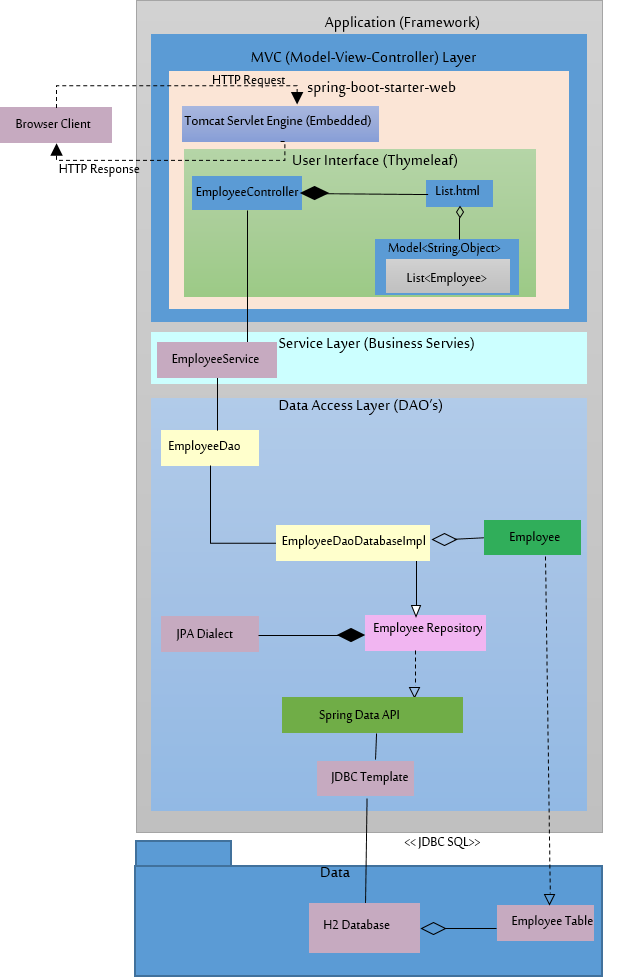

# Employee Management System (EMS)

A very simple Full-Stack Web Application using the **3-tire Architecture** demonestrating the Full **CRUD** Operations With Both **RESTful** services and a **Web Interface**. 

## Dev-Team (BugHunters) 
### Members :
* [Haifa Alassaf](https://github.com/haifassaf)
* [Nada Aljohani](https://github.com/Nada-hs)
* [Sara Alhunaiti](https://github.com/saraAlhunaiti)
* [Hisham Bin Seddeq](https://github.com/HishamBS)

## Description

Lets the user see a list of all employees available in the database **(H2)** . Allowing the user to interact with the data either by **adding** , **deleteing** or **updating** the information of any employee.

## UML Diagram


### Technologies Used

```

- Java
- SpringBoot
- HTML&CSS
- Thymeleaf
- JPA
- SQL
- H2
- JDBC
```
--- 

## Planning and Development Process

* We Started deviding tasks between the team members.
* Each team member started working on his individual task.
* We shared and helped each other.
* We combined our work and made 
  a demo-ready version.

### Problem-Solving Strategy

* lots and lots of googling and reading official documentation.
* Using the refrences supplied to us by our instructor.
  

---


### Sample Pictures

#### Home Page


#### Managment Page


#### Single Employee Information Page


---

## Acknowledgments

- SITE (**Saudi Information Technology Company**) - For their continuous Support.
- **KnowledgeHut** - **Mick** and **Sam**  for being great instructors.

